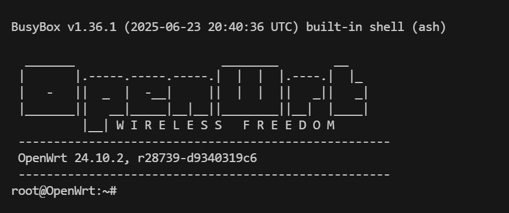
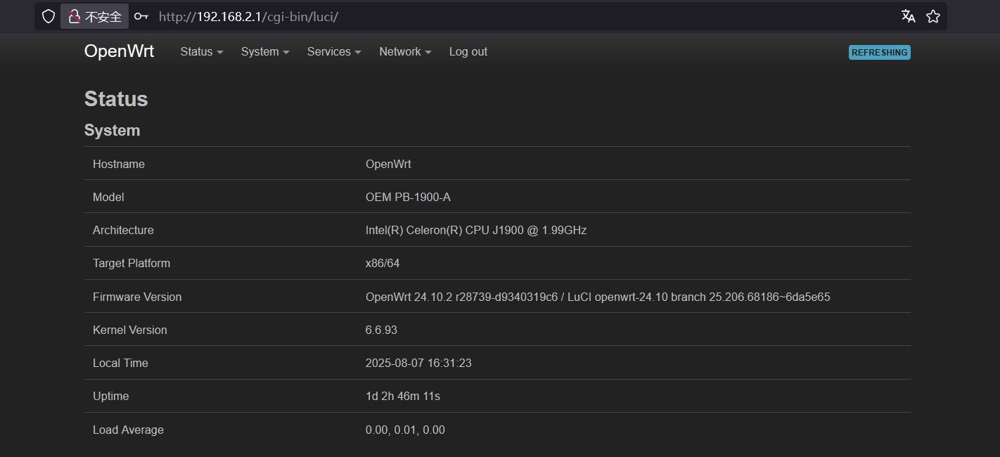
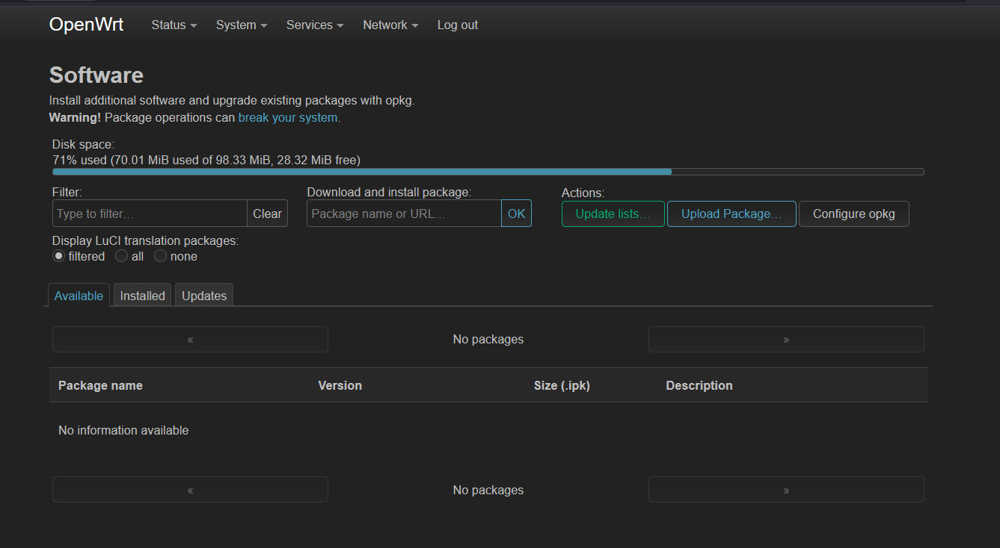
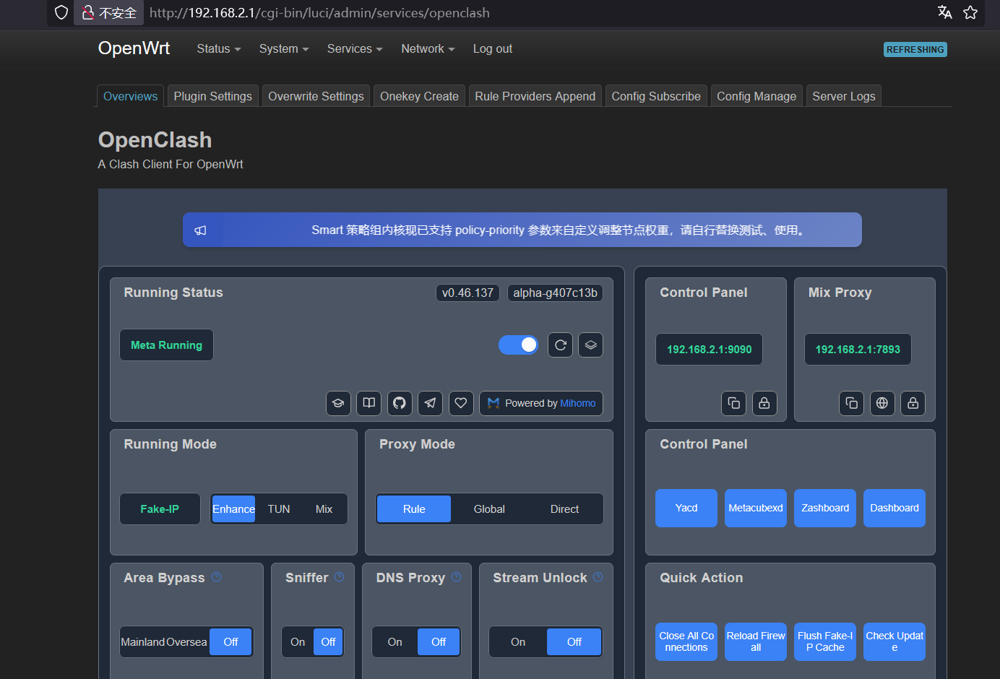

# 搭建一台科学上网的软路由

要想通过路由器实现科学上网，OpenClash 是一个很不错的选择。和常用的 Clash Verge 一样，这也是一个基于 Clash 的代理客户端。由于是专门为 OpenWrt 开发的，建议在 OpenWrt 系统上安装 OpenClash。

要想刷入 OpenClash 系统，可以选择直接在家用路由器上进行，但这存在一定的风险，可能直接导致路由器报废（就和安卓机刷机导致变砖一样）。所以这里就选择了一个 x86 的迷你主机来当软路由，配置不需要很高，内存 2G 已经是绰绰有余，但至少得有双网口。

## 刷写固件

这里我选择直接去 [官网](https://downloads.openwrt.org/releases/24.10.2/targets/) 下载最新的固件。对于近些年生产的 x86 小主机，直接选择 x86/64/generic-ext4-combined-efi.img.gz 就行了。

由于官网提供的都是直接写盘的磁盘镜像文件（.img），所以需要一个 U 盘来运行 live 系统然后写盘（当然也可以直接把小主机的硬盘拆下来连到自己的电脑上然后写盘）。常见的 live 系统比如 WinPe，kali live，Debian Live standard 等都是可以的，甚至直接把 OpenWrt 固件写入 U 盘也是可以当 live 系统使用的（因为只要有 dd 命令就可以执行写盘操作）。这里的 U 盘烧录工具可以选择 Rufus，balenaEtcher 等。

**Steps**

1. 将 live 系统通过烧录工具写入 U 盘
2. 将 U 盘插到小主机的 USB 口，同时插上键鼠和显示器，选择从 U 盘启动进入 live 系统
3. 将固件到 live 系统上，可以 ssh+ftp，也可以现场下载

```bash
wget https://downloads.openwrt.org/releases/24.10.2/targets/x86/64/openwrt-24.10.2-x86-64-generic-ext4-combined-efi.img.gz
```

4. dd 命令写盘

首先需要确认一下小主机的磁盘是哪个，可以 lsblk 看一下，如果小主机预装了 Windows 的话，一般会有 3 个分区，比如 sda1, sda2, sda3，那么 /dev/sda 就是要写盘的目标。

```bash
gzip -d ./generic-ext4-combined-efi.img.gz   # 解压固件
sudo dd if=./generic-ext4-combined-efi.img of=/dev/sda bs=4M status=progress  # 镜像写入硬盘
sudo sync     # 确保完全写入
lsblk         # 确认 sda 已经被分区
sudo reboot
```

5. 拔掉 U 盘，从小主机的硬盘启动就进入了 OpenWrt 系统



## 基本的上网设置

首先 passwd 设置一下密码，然后看一下 /etc/config/network 文件，找一下 wan 口和 lan 口。比如，我的小主机上的网口有两个，标的是 LAN1 和 LAN2，那么在 /etc/config/network 中对应的接口就是 eth0 和 eth1，一般 OpenWrt 默认的 wan 口是 eth1，这个可以自行设置。这里一般需要改一下 lan 口的配置，比如

```
config interface 'lan'
        option device 'br-lan'
        option proto 'static'
        option ipaddr '192.168.1.1'
        option netmask '255.255.255.0'
        option ip6assign '60'
```

由于家用的光猫一般都是 1.0 这个网段的，所以 192.168.1.1 会和它冲突，改成 192.168.0.1，192.168.2.1 等都是可以的

保存后 reboot，拔掉键鼠和显示器，wan 口连到光猫，lan 口连电脑，此时已经可以正常访问 Internet 了，ssh root@192.168.2.1 即可连接，浏览器访问 192.168.2.1 进入后台。这个 web 界面做的是很好的，有专门为移动端设备做了适配。



要开启 WiFi 功能，那么就需要一个路由器开启 AP 模式，然后把小主机的 lan 口接到路由器上，这样路由器就能为局域网发射 WiFi 信号了

## OpenClash

基本也是照着 [官网](https://github.com/vernesong/OpenClash) 的教程来的

```bash
opkg update

opkg install bash dnsmasq-full curl ca-bundle ip-full ruby ruby-yaml kmod-tun kmod-inet-diag unzip kmod-nft-tproxy luci-compat luci luci-base      # 安装依赖
```

https://github.com/vernesong/OpenClash/releases 下载客户端安装包（.ipk），然后在后台的 Software 界面上传并安装



重启一下，就可以看到 OpenClash 的界面了



初次是需要下载 Clash 内核的，可以在 Plugin Settings/Version Update 中 Check Update 来自动下载内核，下载的会比较慢，耐心等待，可以在日志中查看进度。也可以下载完后在 Config Manage 界面上传内核。

总之，内核下好后，OpenClash 就可以启动了，导入自己的机场订阅连接后，局域网内的所有设备都可以科学上网了！

OpenWrt 和 OpenClash 都可以做很多的个性化设置，并且有大量的插件可供选择，许多好玩有用的功能有待探索，这里就不做展开了。
